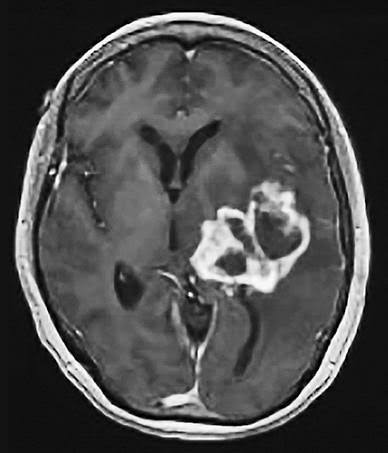
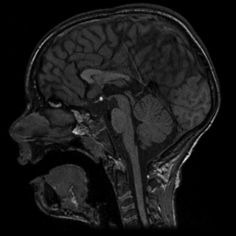

# EfficientNet-Brain-Tumor
EfficientNetV2 Brain Tumor Classification

<h2>
1 EfficientNetV2 Brain Tumor Classification (Updated: 2022/08/03)
</h2>

 This is a simple Brain Tumor Classification project based on <b>efficientnetv2</b> in <a href="https://github.com/google/automl">Brain AutoML</a>
 The Brain Tumor dataset used here has been taken from the following web site: 
 <a href="https://github.com/sartajbhuvaji/brain-tumor-classification-dataset">brain-tumor-classificaiton-dataset</a>
  
 We use python 3.8 and tensorflow 2.8.0 environment on Windows 11. 
<li>
Modified <a href="./CustomDataset.py">CustomDataset</a> class to be able the ImageDataGeneration parameters 
from a data_generator.config file. (2022/08/01). 
</li>
<li>
Modified <a href="./EfficientNetV2ModelTrainer.py">EfficientNetV2ModelTrainer</a> class to save the commandline training parameters
as a file to a model_dir (2022/08/01). 
</li>
<li>
Updated <a href="./projects/Brain-Tumor-Classification/data_generator.config">data_generator.config</a> to improve inference accuracy.
 (2022/08/03). 
</li>
   
<h3>
1.1 Clone repository
</h3>
 Please run the following command in your working directory: 
<pre>
git clone https://github.com/atlan-antillia/EfficientNet-Brain-Tumor.git
</pre>
You will have the following directory tree: 
<pre>
.
├─asset
├─g3doc
└─projects
    └─Brain-Tumor-Classification
        ├─eval
        ├─inference
        ├─test
        ├─Testing
        │  ├─glioma_tumor
        │  ├─meningioma_tumor
        │  ├─no_tumor
        │  └─pituitary_tumor
        └─Training
            ├─glioma_tumor
            ├─meningioma_tumor
            ├─no_tumor
            └─pituitary_tumor
</pre>
The images in test, Testing and Training folders have been taken from
 <a href="https://github.com/sartajbhuvaji/brain-tumor-classification-dataset">brain-tumor-classificaiton-dataset</a>.
  
 
Please run the following commnad to install Python packages for this project. 
<pre>
pip install -r requirements.txt
</pre>
 

<h2>
2 Python classes for Brain Tumor Classification
</h2>
We have defined the following python classes to implement our Brain Tumor Classification. 

<li>
<a href="./CustomDataset.py">CustomDataset</a>
</li>
<li>
<a href="./EpochChangeCallback.py">EpochChangeCallback</a>
</li>

<li>
<a href="./FineTuningModel.py">FineTuningModel</a>
</li>

<li>
<a href="./EfficientNetV2ModelTrainer.py">EfficientNetV2ModelTrainer</a>
</li>

<li>
<a href="./EfficientNetV2Inferencer.py">EfficientNetV2Inferencer</a>
</li>

<h2>
3 Pretrained model
</h2>
 We have used pretrained <b>efficientnetv2-m</b> to train Brain Tumor Classification Model by using
 <a href="https://github.com/sartajbhuvaji/brain-tumor-classification-dataset">brain-tumor-classificaiton-dataset</a>.
Please download the pretrained checkpoint file from <a href="https://storage.googleapis.com/cloud-tpu-checkpoints/efficientnet/v2/efficientnetv2-m.tgz">efficientnetv2-m.tgz</a>, expand it, and place the model under our top repository.

<pre>
.
├─asset
├─efficientnetv2-m
├─g3doc
└─projects
    └─Brain-Tumor-Classification
</pre>

<h2>
4 Train and inference script files
</h2>
<h3>
4.1 Train script
</h3>
Please run the following bat file to train our brain-tumor efficientnetv2 model. 
<pre>
./1_train.bat
</pre>
<pre>
rem 1_train.bat
  --model_dir=./models ^
  --model_name=efficientnetv2-m  ^
  --data_generator_config=./data_generator.config ^
  --ckpt_dir=../../efficientnetv2-m/model ^
  --optimizer=rmsprop ^
  --num_classes=4 ^
  --image_size=384 ^
  --eval_image_size=480 ^
  --data_dir=./Training ^
  --model_dir=./models ^
  --data_augmentation=True ^
  --fine_tuning=True ^
  --monitor=val_loss ^
  --learning_rate=0.002 ^
  --trainable_layers_ratio=0.3 ^
  --num_epochs=50 ^
  --batch_size=4 ^
  --patience=10 ^
  --debug=True 
</pre>

This will generate a <b>best_model.h5</b> in the models folder specified by --model_dir parameter. 
Furthermore, it will generate a <a href="./projects/Brain-Tumor-Classification/eval/train_accuracies.csv">train_accuracies</a>
and <a href="./projects/Brain-Tumor-Classification/eval/train_losses.csv">train_losses</a> files
 
Training console output: 
 
 
Train_accuracies: 
 

 
Train_losses: 
 

 

<h3>
4.2 Inference script
</h3>
Please run the following bat file to infer the brain tumors in test images by the model generated by the above train command. 
<pre>
./2_inference.bat
</pre>
<pre>
rem 2_inference.bat
python ../../EfficientNetV2Inferencer.py ^
  --model_name=efficientnetv2-m  ^
  --model_dir=./models ^
  --fine_tuning=True ^
  --trainable_layers_ratio=0.3 ^
  --image_path=./test/*.jpg ^
  --eval_image_size=480 ^
  --num_classes=4 ^
  --label_map=./label_map.txt ^
  --mixed_precision=True ^
  --infer_dir=./inference ^
  --debug=False 
</pre>
 
label_map.txt:
<pre>
glioma_tumor
meningioma_tumor
no_tumor
pituitary_tumor
</pre>
Sample test images generated by <a href="./projects/Brain-Tumor-Classification/create_test_dataset.py">create_test_dataset.py</a> 
from <a href="./projects/Brain-Tumor-Classification/Testing">Testing</a> taken from
 <a href="https://github.com/sartajbhuvaji/brain-tumor-classification-dataset">brain-tumor-classificaiton-dataset</a>. 
glioma_tumor 
  
meningioma_tumor 
  
no_tumor 
  
pituitary_tumor 
  

This inference command will generate <a href="./projects/Brain-Tumor-Classification/inference/inference.csv">inference result file</a>.
 
Inference console output: 
 
 

Inference result (inference.csv): 
 

